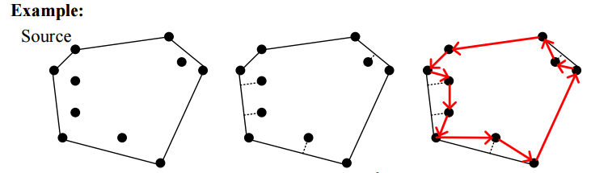

## Problem: Travel Map

Given a map with **n** Points of Interest (POIs) such as Tainan landmarks or local eateries, the task is to help a tourist or a tour group plan a trip in Tainan with the aid of an information system. The following questions need to be answered for trip planning:

### 1. Which two POIs are closest to each other? What is their distance? 
   - Use a **brute-force algorithm** to find the pair of POIs with the minimum distance.

### 2. What is the range of these POIs (Convex-Hull, its area, and the farthest distance)?
   - Use a **brute-force algorithm** to calculate the convex hull of the POIs, along with its area and the maximum distance between any two points on the hull.

### 3. (a) If a tourist starts from a given POI (point a) and needs to visit all n POIs, then return to point a, what is the shortest possible route (Optimal solution)?
   - **Time complexity:** Analyze the complexity.  
   - Solve this as a **Traveling Salesman Problem (TSP)** using **exhaustive search** and **brute-force algorithm**.

### 3. (b) Design a new algorithm (Convex-Hull-TSP Algorithm):
   1. Compute the **Convex-Hull** of all POIs.
   2. For POIs that are not on the Convex-Hull, find the closest point on the hull's edge and project it onto the hull.
   3. Start the tour at an **Extreme Point** and travel in sequence through the projected points, eventually returning to the starting point.
   - Analyze the **time complexity** of this algorithm (using Big O notation) and the total **distance traveled**.

   

### 3. (c) Compare the distances and execution times of the solutions in 3(a) and 3(b):
   - Compare the distance \( d_a \) from 3(a) and the distance \( d_b \) from 3(b), along with the ratio \( \frac{d_b}{d_a} \).
   - Discuss the differences in execution time for both approaches.

---

## Notes:
1. When implementing the program, please specify the **graph representation** used (Adjacency List or Adjacency Matrix).
2. The experiment must analyze the changes in execution time and results as **n** (the number of POIs) varies.
3. The input map can either be provided in **latitude and longitude** coordinates or converted into a **2D coordinate map**.